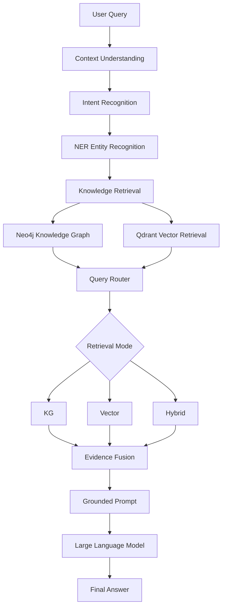

# 🏥 RAGQnASystem

# 医疗领域多源知识增强大语言模型问答系统

> A Medical Knowledge Enhanced RAG Question Answering System based on Knowledge Graph, Vector Retrieval and Large Language Models.


## 📖 项目简介

本项目是一个面向医疗领域的大语言模型知识增强问答系统。

针对医疗场景中知识来源复杂、专业性强以及大语言模型容易产生幻觉等问题，本项目在传统知识图谱问答系统基础上，引入 **Vector RAG、动态检索路由以及 Evidence Grounding 机制**，构建了一个融合结构化医学知识与非结构化医学文档的大模型问答系统。

系统通过：

- Knowledge Graph Retrieval
- Vector Retrieval
- Query Router
- Evidence Fusion
- Grounded Generation

实现医疗知识的精准检索与可靠生成。


---

# ✨ 项目特点


## 1. Knowledge Graph Enhanced RAG

利用 Neo4j 构建医疗知识图谱，用于处理具有明确实体关系的医学知识。


例如：

```
疾病
 |
疾病症状
 |
症状
```


适用于：

- 疾病基本信息查询
- 疾病症状查询
- 疾病治疗方法查询
- 药品关系查询


通过实体识别（NER）定位医学实体，并利用 Cypher 查询获取结构化知识。


---

## 2. Medical Document Vector RAG


针对医学指南、专业文档等非结构化知识，引入向量检索模块。


整体流程：


```
Medical Documents

        ↓

Text Cleaning

        ↓

Chunk Splitting

        ↓

Embedding

        ↓

Qdrant Vector Database

        ↓

Dense Retrieval

        ↓

Cross Encoder Reranking

        ↓

Relevant Evidence

```


相比传统直接向量检索，本项目采用：

**Dense Retrieval + Cross Encoder Reranking**

的二阶段检索策略，提高医学文本召回质量。


---

## 3. Dynamic Query Router


不同类型医疗问题适合不同知识来源。


系统根据：

- 用户问题类型
- 关键词特征
- Knowledge Graph检索结果


动态选择：

```
KG

VECTOR

HYBRID

```


### 示例


### 事实型问题

例如：

```
高血压有哪些症状？
```

使用：

```
Knowledge Graph Retrieval
```


---

### 解释型问题

例如：

```
为什么高血压需要长期管理？
```

使用：

```
Vector Retrieval
```


---

### 综合型问题

例如：

```
高血压患者出现头晕应该如何治疗？
```

使用：

```
KG + Vector Hybrid Retrieval
```


---

## 4. Evidence Grounding


医疗领域中，大语言模型容易产生不可靠医学内容。


因此本项目设计统一 Evidence 层，将不同来源知识统一表示。


Evidence包含：

- source_type
- title
- content
- entity
- relation
- score


不同来源：

```
Neo4j Knowledge Graph

        +

Vector Retrieval

        ↓

Evidence

        ↓

Grounded Prompt

        ↓

LLM Answer

```


生成阶段约束模型：

- 医学事实必须来自检索证据；
- 不生成未被支持的信息；
- 当证据不足时明确说明。


从而降低模型幻觉风险。


---

# 🏗️ 系统架构





---

# 🔥 核心模块


## 1. Knowledge Graph Module


### 技术

- Neo4j
- Cypher Query
- Entity Recognition


### 功能

负责结构化医学知识查询：

- 疾病
- 症状
- 药物
- 治疗方式


通过 KG Client 对 Neo4j 查询进行统一封装。


---

## 2. Vector Retrieval Module


### 技术

- Embedding Model
- Qdrant
- Cross Encoder Reranker


### Retrieval Pipeline


```
Query

↓

Embedding

↓

Vector Search

↓

Candidate Documents

↓

Reranking

↓

Top Relevant Documents

```


二阶段检索：

第一阶段：

快速召回候选文本。


第二阶段：

Cross Encoder 根据 Query-Document 交互重新计算相关性。


---

## 3. Retrieval Router Module


系统根据问题特点选择不同检索策略。


主要逻辑：

```
Question

↓

Intent / Rule Analysis

↓

KG Evidence Check

↓

Select Retrieval Mode

```


支持：

- KG
- Vector
- Hybrid


---

## 4. Evidence Module


用于统一管理不同来源检索结果。


支持：

- Knowledge Graph Evidence
- Vector Evidence


为后续大语言模型生成提供可靠上下文。


---

# 🧠 Extended Agent Module


项目额外实现了 Multi-Memory Agent 扩展模块。


包括：

## Global Medical Knowledge

医学知识库。


## Case Memory

病例经验信息。


## Semantic Memory

医学语义知识。


该模块用于未来进一步扩展医疗 Agent 能力。


---

# 🛠️ 技术栈


| 模块 | 技术 |
| --- | --- |
| Programming Language | Python |
| LLM | Ollama |
| Knowledge Graph | Neo4j |
| Vector Database | Qdrant |
| Embedding | BGE / E5 |
| Reranker | BGE Reranker |
| NLP Model | BERT |
| Web Interface | Streamlit |


---

# 📂 项目结构


```
RAGQnASystem

├── login.py                 # Web入口

├── webui.py                 # 主问答流程

├── kg_client.py             # Neo4j查询封装

├── vector_rag.py            # 向量检索模块

├── query_router.py           # 检索路由模块

├── evidence.py              # Evidence定义

├── medical_agent.py         # Agent扩展模块

├── context_fusion.py        # 上下文融合模块

├── global_medical_kb.py     # 医学知识库

├── case_memory.py           # 病例记忆

├── semantic_memory.py       # 语义记忆

├── build_up_graph.py        # 构建知识图谱

├── build_vector_index.py    # 构建向量索引

├── build_global_kb.py       # 构建医学知识库

├── config.py                # 配置文件

└── requirements.txt

```


---

# 🚀 Installation


## Environment


推荐：

```
Python >= 3.10
```


安装依赖：


```bash
pip install -r requirements.txt
```


---

# 📦 Data Preparation


## 1. Build Knowledge Graph


启动 Neo4j 后：


```bash
python build_up_graph.py
```


---

## 2. Build Vector Index


准备医学文档：

```
medical_docs/
```


运行：

```bash
python build_vector_index.py
```


---

## 3. Build Global Medical Knowledge Base


运行：


```bash
python build_global_kb.py
```


---

# ▶️ Run


启动 Ollama：


```bash
ollama serve
```


启动系统：


```bash
streamlit run login.py
```


---

# 📌 Example


输入：

```
高血压有哪些症状？
```


系统流程：

```
Question

↓

NER识别疾病实体

↓

Neo4j查询

↓

KG Evidence

↓

Grounded Generation

↓

Answer

```


---

# 🔮 Future Improvements


## 1. Learning-based Query Router

目前 Router 基于规则策略。

未来可以利用历史 Query 和反馈数据训练分类模型，实现更加智能的动态路由。


---

## 2. RAG Evaluation


增加自动化评估：

- Recall@K
- MRR
- Faithfulness
- Answer Relevance


---

## 3. Online Feedback Optimization


利用用户反馈：

- 优化检索策略
- 优化Prompt
- 提升回答质量


---

# 📚 Summary


本项目实现了一套医疗领域多源知识增强大语言模型问答系统：

- 使用 Neo4j 实现结构化医学知识检索；
- 使用 Qdrant 实现医学文档向量检索；
- 使用 Query Router 实现 KG / Vector / Hybrid 动态选择；
- 使用 Evidence Grounding 降低大模型幻觉；
- 支持医疗 Agent 和 Memory 模块扩展。

